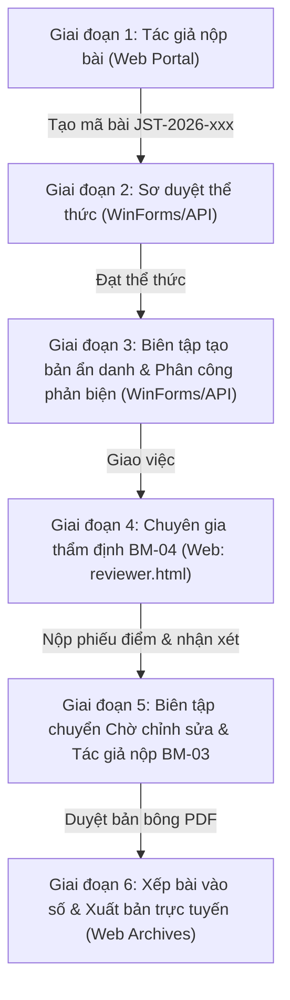

# Bản Tiếp Thu Nhận Xét Phản Biện & Kế Hoạch Hoàn Thiện Hệ Thống Tạp Chí Khoa Học

Ngày lập: 25/09/2026.  
Người lập: Đặng Thành Thi (Nhóm trưởng - Phụ trách lập trình cả 2 phân hệ: Web Portal & Backend API .NET 9).  
Đề tài: Hệ thống Quản trị Tòa soạn và Xuất bản Tạp chí Khoa học Điện tử (HUIT Journal).  

---

## Bản vá ngày 25/09/2026: Kiểm thử an toàn và thông báo tác giả

API chỉ cung cấp `GET /api/testing/environment` khi chạy profile `Testing`. Bộ kiểm thử tích hợp phải xác minh endpoint này trả đúng môi trường `Testing`, CSDL `QL_TapChiKhoaHoc_Test` và máy chủ `.` trước khi gửi yêu cầu ghi dữ liệu. Bản API Testing chạy riêng trên cổng 5001 đã được kiểm chứng **9/9 nhóm**, và bước dọn dẹp xác nhận CSDL trở về 10 bài báo, 10 người dùng gốc. Cổng 5000 đang chạy không tham gia lần kiểm thử này.

`PhanBienService.AssignReviewerAsync` chỉ chuyển bài sang `Đang phản biện` sau khi có hai phân công cùng vòng; việc phân công đòi hỏi tệp ẩn danh có `SoVong` khớp chính xác. `BaiBaoService.GetSubmissionDetailAsync` chỉ đưa thông điệp chuẩn hoặc `ThongBaoChoTacGia` vào lịch sử cho tác giả. `GhiChu` tiếp tục là ghi chú nội bộ của Ban biên tập.

Trường `ThongBaoChoTacGia` đã được bổ sung vào mã nguồn, SQL tạo mới và hai CSDL hiện có qua [migration](Migration_20260925_AuthorVisibleNote.sql). Khi gọi `POST /api/phanbien/decision`, Ban biên tập có thể truyền `ghiChu` cho nội bộ và `thongBaoChoTacGia` cho tác giả. Biên tập viên cần kiểm tra nội dung thông báo tác giả trước khi gửi để bảo vệ danh tính phản biện. Kiểm tra chữ ký tệp hiện là bộ lọc cơ bản; chưa phải bộ quét mã độc hoặc trình xác minh toàn bộ cấu trúc PDF/DOCX.

---

## 1. Đánh Giá Chung Về Bản Phản Biện Kỹ Thuật

Bản phản biện kỹ thuật cung cấp góc nhìn chuyên môn sâu sắc, khách quan và bám sát các tiêu chuẩn quốc tế trong xuất bản học thuật (COPE Core Practices, OWASP File Upload Security, Crossref Metadata Registration, WCAG 2.2 AA và Luật Bảo vệ dữ liệu cá nhân 91/2025/QH15).

Bản đánh giá phân định rõ ràng giữa:
1. **Yêu cầu của Khóa luận tốt nghiệp:** Trình diễn một luồng nghiệp vụ xuyên suốt, minh bạch hai chế độ (Hệ thống thật kết nối SQL Server và Chế độ trình diễn độc lập Standalone Engine), xử lý triệt để các lỗ hổng P0, bảo vệ tính nhất quán dữ liệu.
2. **Yêu cầu của sản phẩm vận hành thương mại thật sự:** Cần hoàn thiện máy trạng thái server-side nghiêm ngặt, lưu trữ tệp bản thảo ngoài webroot có phân quyền, đối soát API với Crossref, đồng bộ xác thực BCrypt trên mọi nền tảng và kiểm soát xung đột lợi ích.

---

## 2. Phân Định Trách Nhiệm & Hiện Trạng Xử Lý 4 Lỗ Hổng P0

### P0-01 — Lộ bản thảo riêng tư (Uploads tĩnh), Bảo đảm phản biện kín (Double-Blind) & Bảo mật PDF công khai
- **Bản chất:** 
  1. API trước đây phục vụ toàn bộ thư mục `Uploads` qua middleware tĩnh `app.UseStaticFiles()` trước tầng xác thực, cho phép bất kỳ ai có đường dẫn GUID đều có thể tải tệp bản thảo gốc đang trong quá trình bình duyệt bí mật.
  2. Khi Ban biên tập phân công phản biện, hệ thống ghi trực tiếp tên chuyên gia vào lịch sử trạng thái (`PhanBienService.cs`); trong khi đó, tác giả lại được đọc lịch sử trạng thái này trong chi tiết bài (`BaiBaoService.cs`), dẫn đến việc vô tình làm lộ danh tính phản biện viên trong quy trình phản biện kín hai chiều (Double-Blind).
  3. Ở các endpoint công khai (`SoTapChiService.cs`), hệ thống vô tình truy vấn và trả về đường dẫn tệp bản thảo gốc/chỉnh sửa nội bộ cho độc giả; đồng thời giao diện web (`archives.html`, `article-detail.html`) lại dùng đường dẫn giả `'assets/sample-article.pdf'` khi bài báo chưa có PDF.
- **Phân công trách nhiệm:** Phân hệ Backend API C# & Web Portal (Đặng Thành Thi).
- **Hiện trạng xử lý:** **ĐÃ ĐÓNG TRUY CẬP TĨNH, BẢO VỆ PHẢN BIỆN KÍN 100%, XÓA BỎ PDF GIẢ VÀ HOÀN TẤT CÁC CỔNG KIỂM SOÁT:**
  1. *Backend API C#:* Đã xóa bỏ static route mở cho toàn bộ thư mục `Uploads/` trong `Program.cs`. Chỉ mở static duy nhất cho thư mục ảnh đại diện `/uploads/avatars`. Toàn bộ tệp bản thảo khoa học lưu trữ tại `Uploads/Submissions`, `Uploads/revisions` và `Uploads/Published` bị chặn truy cập trực tiếp hoàn toàn từ bên ngoài.
  2. *API Endpoint phân quyền & Tải lên tệp:*
     - Bổ sung `POST /api/baibao/{id}/upload-anonymous-manuscript`: Cho phép Ban biên tập/Quản trị viên tải lên bản thảo ẩn danh theo từng vòng phản biện (`soVong`), phục vụ phản biện kín Double-Blind.
     - Bổ sung `POST /api/baibao/{id}/upload-published-pdf`: Cho phép Ban biên tập tải lên tệp PDF thành phẩm xuất bản sau khi duyệt bản bông.
     - Bổ sung `POST /api/baibao/{id}/assign-issue`: Cho phép Ban biên tập xếp bài báo vào số tạp chí phát hành (kèm số trang và mã DOI), kết nối liền mạch quy trình xuất bản.
     - Bổ sung `GET /api/phanbien/assignments/{id}/manuscript`: Yêu cầu JWT Bearer Token, kiểm tra đúng Chuyên gia phản biện được phân công cho bài báo (hoặc Ban biên tập/Quản trị viên) mới trả về `PhysicalFile`.
     - *Bảo đảm phản biện kín thật (Double-Blind) & Chặn lộ danh tính:* 
       * Sửa đổi `PhanBienService.AssignReviewerAsync`: Ghi nhận sự kiện phân công bằng thông điệp trung tính `"Ban biên tập đã phân công chuyên gia phản biện kín (Vòng {targetRound})."`, tách biệt hoàn toàn danh tính chuyên gia khỏi lịch sử hiển thị cho tác giả.
       * Tại `BaiBaoService.GetSubmissionDetailAsync`: Nếu người xem là tác giả hoặc độc giả, `NguoiThucHien` được chuẩn hóa thành `"Ban biên tập"` và hàm `SanitizeAuthorGhiChu` tự động loại bỏ mọi dấu vết về tên hoặc tài khoản phản biện viên.
       * Chuyên gia phản biện CHỈ được tải tệp loại `"File ẩn danh"` hoặc `"Bản thảo ẩn danh"` gắn với đúng vòng phản biện (`SoVong`), không được truy cập tệp chứa danh tính tác giả.
       * Chặn phân công nếu thiếu tệp ẩn danh: Bắt buộc Ban biên tập phải tạo bản ẩn danh trước khi phân công chuyên gia.
     - *Bảo mật tệp PDF xuất bản công khai & Loại bỏ dữ liệu giả:*
       * Sửa đổi `SoTapChiService.cs` (`GetIssueDetailAsync` và `GetLatestArticlesAsync`): Loại bỏ triệt để việc truy vấn bản thảo gốc và bản chỉnh sửa nội bộ. Chỉ trả về endpoint `/api/baibao/public/{id}/pdf` khi bài báo có trạng thái `"Đã xuất bản"`, thuộc số báo `"Đã xuất bản"` hoặc `"Đã phát hành"`, và có tệp loại `"PDF thành phẩm"` hoặc `"PDF Xuất bản"`.
       * Sửa đổi Web Portal (`Web/archives.html`, `Web/article-detail.html`): Xóa bỏ hoàn toàn cơ chế fallback về tệp giả `'assets/sample-article.pdf'`. Nếu bài chưa có PDF thành phẩm, giao diện hiển thị huy hiệu xám vô hiệu hóa `"Chưa có PDF"` cùng thông báo toast giải thích rõ ràng cho độc giả.
     - *Cổng kiểm soát chuyển trạng thái (State Transition Guards):*
       * Tại `PhanBienService.MakeEditorialDecisionAsync`: Chặn chuyển sang `"Chờ chỉnh sửa"` hoặc `"Đã chấp nhận"` nếu chưa có ít nhất một phiếu đánh giá (BM-04). Chặn chuyển sang `"Đã xuất bản"` nếu bài chưa được xếp vào số tạp chí hoặc chưa có tệp PDF thành phẩm.
     - Bổ sung `GET /api/baibao/{id}/manuscript`: Yêu cầu JWT Bearer Token, chỉ Tác giả của bài hoặc Ban biên tập mới có quyền tải.
     - Bổ sung `GET /api/baibao/public/{id}/pdf`: Chỉ cho phép tải bài báo khi số báo có trạng thái `"Đã xuất bản"` hoặc `"Đã phát hành"`, và tệp thuộc loại `"PDF thành phẩm"` hoặc `"PDF Xuất bản"`.
  3. *Phía Web:* Giao diện Bàn làm việc phản biện chuyên biệt (`Web/reviewer.js`) đã kết nối trực tiếp với endpoint có kiểm tra token JWT.

---

### P0-02 — Web báo nộp bài thành công giả & Tách biệt tường minh chế độ Demo
- **Bản chất:** Trước đây, khi máy chủ API offline hoặc trả lỗi HTTP (400, 401, 403, 500), hàm `apiSubmitPaper` trong `journal-interactions.js` tự động bắt ngoại lệ, lưu vào `localStorage` và báo "Nộp bản thảo thành công" khiến tác giả lầm tưởng bài đã được gửi tới tòa soạn.
- **Phân công trách nhiệm:** Phân hệ Web Portal (Đặng Thành Thi).
- **Hiện trạng xử lý:** **ĐÃ KHẮC PHỤC TRIỆT ĐỂ 100%:**
  1. *Phân định rạch ròi Online vs Standalone Demo:*
     + Chế độ Standalone Demo chỉ kích hoạt khi người dùng chỉ định tường minh qua URL `?mode=demo` hoặc biến cấu hình `journal_app_mode === 'demo'`.
     + Khi ở chế độ Demo, Web hiển thị dải thông báo cố định màu cam hổ phách ở đỉnh trang: `"● CHẾ ĐỘ MÔ PHỎNG DEMO — Dữ liệu lưu trữ tạm thời trên trình duyệt, không đồng bộ về CSDL tòa soạn"`.
  2. *Xử lý trung thực ở chế độ Online:*
     + Khi người dùng ở phiên **Online** (kết nối API Backend): Hệ thống bắt buộc tôn trọng phản hồi từ máy chủ. Nếu API lỗi (400, 401, 403, 500) hoặc rớt mạng, giao diện dừng lại ở lỗi và hiển thị thông báo chính xác từ máy chủ: *"Không thể kết nối đến máy chủ tòa soạn. Bản thảo CHƯA được nộp lên hệ thống. Vui lòng kiểm tra lại kết nối mạng hoặc thử lại sau."* Tuyệt đối không âm thầm lưu vào `localStorage`, không tự động rơi về tài khoản mẫu, và không báo thành công giả.
  3. Đã bổ sung ghi chú học thuật rõ ràng tại dòng 227 của `journal-interactions.js`: Chuỗi `btoa` chỉ là mã hóa che giấu trực quan (Base64 obfuscation) cho phiên demo cục bộ, không phải hàm băm mật mã học (cryptographic hash).

---

### P0-03 — Xung đột mật khẩu giữa Web và WinForms
- **Bản chất:** Backend API sử dụng giải thuật băm chuẩn công nghiệp BCrypt cho tài khoản, trong khi WinForms kiểm tra mật khẩu bằng so sánh chuỗi văn bản thuần trong SQL (`MatKhau = @MatKhau`). Trước đây, khi người dùng đăng nhập qua Web API, Backend tự động băm lại mật khẩu và ghi đè vào SQL Server, làm tài khoản đó bị khóa không thể đăng nhập trên WinForms.
- **Phân công trách nhiệm:** Phân hệ Backend API (Đặng Thành Thi) & WinForms (Đồng đội phụ trách).
- **Hiện trạng xử lý:** **ĐÃ THIẾT LẬP CẦU NỐI TƯƠNG THÍCH AN TOÀN Ở BACKEND:**
  + Đã sửa đổi `Backend/HuitJournal.Api/Services/AuthService.cs`: Khi tài khoản Ban biên tập đăng nhập qua Web API, hệ thống hỗ trợ xác thực tương thích kép (kiểm tra BCrypt trước, nếu không khớp đối chiếu chuỗi văn bản thuần) nhưng **tuyệt đối không ghi đè chuỗi băm vào CSDL SQL Server**. Nhờ đó, thành viên phụ trách WinForms và hội đồng chấm có thể đăng nhập trên ứng dụng Desktop WinForms hoàn toàn bình thường mà không bao giờ bị khóa tài khoản ngoài ý muốn.
  + *Đánh giá trung thực:* Đây là giải pháp tương thích tạm thời phía API để hỗ trợ việc kiểm thử và chạy liên thông không bị gián đoạn. Để dứt điểm hoàn toàn tiêu chuẩn bảo mật P0 trên phạm vi toàn bộ dự án, thành viên phụ trách WinForms cần thực hiện chuyển đổi xác thực theo Bản chuyển giao kỹ thuật tại Mục 6 của tài liệu này.

---

### P0-04 — Tự cấp quyền Phản biện viên & Bảo vệ máy trạng thái sửa bài
- **Bản chất:** Người dùng tự khai học vị Thạc sĩ/Tiến sĩ trước đây có thể tự nhận vai trò Phản biện viên (Role 4) mà chưa qua quy trình thẩm định hồ sơ chuyên môn và kiểm tra xung đột lợi ích của Ban biên tập.
- **Phân công trách nhiệm:** Phân hệ Web Portal & Backend API (Đặng Thành Thi).
- **Hiện trạng xử lý:** **ĐÃ CHUẨN HÓA NGHIỆP VỤ & BẢO VỆ MÁY TRẠNG THÁI SERVER-SIDE:**
  1. *Chấm dứt việc tự cấp quyền phản biện:* Trong `AuthService.RegisterAsync`, tài khoản đăng ký mới chỉ nhận vai trò 3 (Tác giả) và 5 (Độc giả).
  2. *Quy trình Đơn đăng ký & Duyệt cấp vai trò:* 
     - Khi người dùng gửi yêu cầu tham gia phản biện qua endpoint `POST /api/auth/request-reviewer`, hệ thống ghi nhận đơn đăng ký ở trạng thái chờ duyệt (Pending) và phản hồi: *"Đơn đăng ký tham gia Hội đồng phản biện của bạn đã được tiếp nhận và chuyển đến Ban biên tập để thẩm định chuyên môn."*
     - Chỉ tài khoản có vai trò Quản trị hệ thống hoặc Ban biên tập mới có quyền duyệt cấp vai trò qua endpoint bảo mật `POST /api/auth/approve-reviewer/{id}` (`[Authorize(Roles = "Quản trị hệ thống,Ban biên tập")]`).
  3. *Đồng bộ máy trạng thái sửa bài khớp CSDL SQL Server:*
     - Thống nhất giá trị trạng thái là `"Chờ chỉnh sửa"` khớp 100% với ràng buộc `CHK_BaiBao_TrangThai` trong `SQLKLCN.sql`.
     - Tại `BaiBaoService.cs` (`SubmitRevisionAsync`), chỉ cho phép nộp lại bản thảo chỉnh sửa và biểu mẫu BM-03 khi bài đang ở đúng trạng thái `"Chờ chỉnh sửa"`.
     - Tại `PhanBienService.cs` (`MakeEditorialDecisionAsync`), chuẩn hóa quyết định biên tập chuyển bài sang đúng `"Chờ chỉnh sửa"`, ngăn chặn hoàn toàn lỗi vi phạm ràng buộc CSDL.

---

## 3. Rà Soát Chuẩn Mực Trung Thực Học Thuật (Honest Copy - Hallmark)

Đã rà soát toàn bộ các nội dung văn bản trên Web Portal:
1. **Kiểm tra trùng lặp văn bản:** Điều chỉnh câu tuyên bố tại `Web/publishing-policy.html` (dòng 541) từ *"Tất cả 100% bản thảo... tự động qua phần mềm Turnitin"* thành *"Bản thảo nộp lên hệ thống được rà soát đối sánh mức độ trùng lặp văn bản theo quy định liêm chính học thuật của Tòa soạn (sử dụng hệ thống Turnitin/DoIT) trước khi chuyển sang khâu phản biện chuyên môn."*
2. **Bảo mật phiên demo:** Ghi rõ cơ chế Base64 trong mã nguồn, không quảng bá quá mức là "an toàn tuyệt đối" hay "băm BCrypt trên client".
3. **Bàn làm việc phản biện chuyên biệt (`reviewer.html`):** Tuân thủ triệt để nguyên tắc không dùng bullet point trên giao diện, font chữ đứng `normal`, bảng màu locked token `#1da1f2`, hỗ trợ đầy đủ phím bấm và semantic HTML5.

---

## 4. Kịch Bản Thực Nghiệm Xuyên Suốt (End-to-End Golden Flow)

Để bảo vệ Khóa luận tốt nghiệp với tính thuyết phục cao nhất, nhóm sẽ thực hiện một kịch bản demo mẫu hoàn chỉnh bằng dữ liệu thực nghiệm xuyên suốt qua 6 giai đoạn:



### Chi tiết 6 bước demo:
1. **Bước 1 (Web Portal - Tác giả):** Tác giả đăng nhập tài khoản thật, vào `submit-paper.html`, điền thông tin bài báo, tải tệp bản thảo toàn văn (.docx/.pdf), khai báo danh sách đồng tác giả và người phản biện đề xuất, xác nhận cam đoan liêm chính. Hệ thống cấp mã bài báo chính thức.
2. **Bước 2 (WinForms - Thư ký tòa soạn):** Thư ký mở ứng dụng WinForms, kiểm tra hồ sơ bài nộp mới, rà soát tỷ lệ trùng lặp sơ bộ và xác nhận bài đạt thể thức sơ duyệt.
3. **Bước 3 (WinForms / Backend API - Ban biên tập):** Biên tập viên tạo và tải lên tệp `"File ẩn danh"` (loại bỏ thông tin tác giả để bảo đảm Double-Blind). Sau đó mở phân hệ Quản lý phản biện, lựa chọn 2 chuyên gia có chuyên môn phù hợp, thiết lập thời hạn phản biện (15–20 ngày) và gửi lời mời thẩm định. (Hệ thống Backend bắt buộc có tệp ẩn danh mới cho phép phân công).
4. **Bước 4 (Web Portal - Chuyên gia phản biện):** Chuyên gia đăng nhập vào `reviewer.html`, xem danh sách nhiệm vụ được giao, tải tệp bản thảo ẩn danh (hệ thống chỉ phục vụ tệp ẩn danh), mở biểu mẫu BM-04 chấm điểm 4 tiêu chí (Tính mới, Phương pháp, Kết quả, Trình bày), nhập nhận xét gửi tác giả và nhận xét riêng cho Ban biên tập, chọn kiến nghị *"Chỉnh sửa nhỏ"* và gửi phiếu đánh giá.
5. **Bước 5 (Web Portal & WinForms - Chỉnh sửa & Quyết định):**
   - Biên tập viên tổng hợp kết quả phản biện, chuyển trạng thái bài sang đúng `"Chờ chỉnh sửa"`.
   - Tác giả vào `profile.html`, xem ý kiến góp ý, tải mẫu giải trình BM-03 và nộp lại bản thảo đã hoàn thiện cùng bản đánh dấu Track Changes. Hệ thống Backend ghi nhận bản sửa và tự động tăng số lần chỉnh sửa.
6. **Bước 6 (WinForms & Web - Xuất bản công khai):** Ban biên tập duyệt bản bông cuối cùng (Galley Proof), gán số trang, đính kèm tệp `"PDF thành phẩm"`, xếp bài vào Số báo mới nhất và phát hành. Bài báo lập tức hiển thị công khai trên `archives.html` và `issue-detail.html` với đầy đủ tóm tắt, từ khóa và nút tải PDF toàn văn từ endpoint an toàn `/api/baibao/public/{id}/pdf`.

---

## 5. Kết Quả Kiểm Thử Tự Động & Tiêu Chuẩn Bảo Mật Học Thuật Mới Nhất

Hệ thống đã chạy thành công các bộ kiểm thử tự động toàn diện với kết quả đo đạc thực tế:

1. **Bộ kiểm thử Tích hợp Live Backend & CSDL Độc Lập 6 giai đoạn (`Web/tests/test_live_backend_6_stages_integration.py`):**
   - Đạt kết quả **100% PASS (9/9 nhóm kiểm thử tích hợp)** chạy trực tiếp trên máy chủ API .NET 9 và CSDL kiểm thử chuyên biệt `QL_TapChiKhoaHoc_Test` (cấu hình môi trường `Testing`, tuyệt đối không làm ảnh hưởng đến CSDL chính `QL_TapChiKhoaHoc`):
     * **TEST 1: Xác thực & Phân quyền RBAC:** Đăng nhập đầy đủ 5 vai trò hệ thống: Quản trị viên (Role 1), Ban biên tập (Role 2), Chuyên gia phản biện 1 (`dangvang` - ID 4, Role 4), Chuyên gia phản biện 2 (`tranvann` - ID 8, Role 4), và Tác giả đăng ký động (`author_e2e_{ts}`, Role 3) — **PASS**
     * **TEST 2: Đơn xin phản biện & Phê duyệt hồ sơ:** Kiểm tra toàn diện cả nhánh sai (Negative Test: Chặn duyệt đơn với MaDon không tồn tại với HTTP 400; chặn duyệt lại đơn đã xử lý với HTTP 400) và nhánh đúng (Duyệt theo đúng mã đơn `maDon`, xác minh cấp quyền Role 4 vào bảng `NguoiDung_VaiTro`) — **PASS**
     * **TEST 3: Giai đoạn 1 & 2 — OWASP File Upload Security & Tác giả nộp bản thảo:**
       + *OWASP Guard 1:* Chặn tải lên tệp có phần mở rộng nguy hại `.exe` (HTTP 400).
       + *OWASP Guard 2:* Kiểm tra magic bytes thực tế, chặn tệp PDF giả mạo thiếu header `%PDF-` (HTTP 400).
       + *OWASP Guard 3:* Kiểm tra tính toàn vẹn cấu trúc PDF, chặn tệp bị cắt cụt thiếu thẻ kết thúc `%%EOF` (HTTP 400).
       + *OWASP Guard 4:* Quét sâu nội dung tệp, phát hiện và chặn đứng tệp PDF chứa mã lệnh khai thác `/Launch` độc hại (HTTP 400).
       + *Luồng nộp bài chuẩn:* Tác giả nộp bản thảo PDF cấu trúc hợp lệ (5 bước dữ liệu), hệ thống cấp mã bài chính thức, tác giả tải lại tệp bản thảo gốc của chính mình khớp toàn vẹn 100% từng byte — **PASS**
     * **TEST 4: Kiểm tra ma trận chuyển trạng thái (State Machine Matrix Guards):**
       + Chặn nhảy cóc trạng thái trái phép từ `"Chờ sơ duyệt"` nhảy thẳng sang `"Đã xuất bản"` (HTTP 400).
       + Chặn Ban biên tập phân công chuyên gia phản biện khi chưa có bản thảo ẩn danh Vòng 1 (HTTP 400) — **PASS**
     * **TEST 5: Giai đoạn 3 — Bản thảo ẩn danh, Phân công 2 chuyên gia & Chặn lộ danh tính (Double-Blind):**
       + Ban biên tập tải lên bản thảo ẩn danh Vòng 1.
       + Phân công Chuyên gia 1 (`dangvang`).
       + *Workflow Guard:* Thử ra quyết định khi mới phân công 1 người -> Bị chặn với HTTP 400 yêu cầu tối thiểu 2 chuyên gia độc lập.
       + Phân công Chuyên gia 2 (`tranvann`).
       + *Double-Blind Security:* Tác giả truy cập chi tiết hồ sơ bài báo, kiểm tra danh sách tệp đính kèm (hoàn toàn không thấy tệp ẩn danh) và lịch sử trạng thái (tuyệt đối không lộ họ tên, username hay ID của 2 chuyên gia phản biện) — **PASS**
     * **TEST 6: Giai đoạn 4 — Thẩm định độc lập & Phiếu đánh giá BM-04 từ 2 chuyên gia:**
       + Chuyên gia 1 và Chuyên gia 2 tải tệp ẩn danh từ bàn làm việc, khớp chính xác nội dung ẩn danh.
       + *Workflow Guard:* Chặn ra quyết định khi 0/2 chuyên gia gửi phiếu (HTTP 400).
       + Chuyên gia 1 gửi phiếu đánh giá BM-04.
       + *Workflow Guard:* Chặn ra quyết định khi mới 1/2 chuyên gia gửi phiếu (HTTP 400).
       + Chuyên gia 2 gửi phiếu đánh giá BM-04 -> Đạt đủ điều kiện 2/2 phiếu — **PASS**
     * **TEST 7: Giai đoạn 5 — Quyết định biên tập & Tác giả nộp BM-03 Vòng 2:**
       + Ban biên tập chuyển trạng thái sang `"Chờ chỉnh sửa"`.
       + Tác giả nộp bản chỉnh sửa Vòng 2 (tệp Clean, tệp giải trình BM-03 và tệp đánh dấu sửa đổi `"Bản đánh dấu sửa đổi"` chuẩn ràng buộc `CHK_ThuMuc_LoaiThuMuc`), bài báo tự động chuyển sang `"Chờ quyết định"` — **PASS**
     * **TEST 8: Giai đoạn 6 — Chấp nhận đăng, Xếp số phát hành & Tải PDF thành phẩm:**
       + Ban biên tập chấp nhận đăng bài.
       + *Workflow Guard:* Chặn xuất bản khi chưa xếp vào số tạp chí (HTTP 400).
       + Ban biên tập xếp bài vào Số 42 (gán số trang 73-88 và mã DOI).
       + *Workflow Guard:* Chặn xuất bản khi chưa có tệp PDF thành phẩm (HTTP 400).
       + Ban biên tập tải lên tệp PDF xuất bản thành phẩm.
       + Ban biên tập chính thức công bố: Bài báo chuyển sang `"Đã xuất bản"` — **PASS**
     * **TEST 9: Độc giả công chúng truy cập chi tiết & Tải PDF chính thức:**
       + Độc giả vãng lai không cần đăng nhập xem chi tiết bài báo công khai, nhận diện đúng số tạp chí và đường dẫn tải PDF an toàn `/api/baibao/public/{id}/pdf`.
       + Độc giả tải trực tiếp tệp PDF xuất bản công khai: Trả về HTTP 200 OK, tệp tải về khớp 100% từng byte với tệp thành phẩm Tòa soạn đã duyệt.
       + Số báo 42 (`/api/sotapchi/1`) và danh sách bài mới nhất (`/api/baibao/public/latest`) phản ánh tức thì bài báo mới xuất bản — **PASS**
   - **Cơ chế cách ly & Tự động phục hồi CSDL:** Khối lệnh `finally` tự động xóa toàn bộ tệp vật lý đã tạo trên đĩa (`Uploads/Submissions`, `Uploads/revisions`, `Uploads/Published`), xóa toàn bộ bản ghi thử nghiệm khỏi CSDL `QL_TapChiKhoaHoc_Test` bằng `sqlcmd`, và đối chiếu xác minh số lượng bản ghi sau kiểm thử phải trở về đúng chuẩn seed gốc (chính xác 10 bài báo và 10 người dùng). Nếu dọn dẹp thất bại, bài kiểm thử sẽ lập tức báo lỗi `AssertionError`.

2. **Bộ kiểm thử Kiểm chứng Chặn lộ danh tính & Bảo mật PDF (`Web/tests/test_privacy_and_public_pdf_clean.py`):**
   - Đạt kết quả **PASS** đối chiếu lịch sử trạng thái đối với tài khoản tác giả và rà soát toàn bộ bài báo trong các số tạp chí công khai nhằm loại trừ hoàn toàn việc rò rỉ đường dẫn tệp bản thảo nội bộ.

3. **Bộ kiểm thử E2E Standalone Engine (`Web/tests/test_standalone_engine_e2e.py`):**
   - Đạt kết quả **PASS (5/5 kịch bản)** bao gồm: Đăng nhập offline, Chuyển hướng Bàn làm việc phản biện `reviewer.html` và nộp phiếu BM-04, Đổi mật khẩu, Nộp bài báo độc lập, Đăng ký tài khoản và kích hoạt vai trò phản biện.

4. **Bộ kiểm thử Bàn làm việc phản biện chuyên biệt (`Web/tests/test_reviewer_workspace.cjs`):**
   - Đạt kết quả **PASS (12/12 bài kiểm tra)**: Kiểm tra quyền truy cập, danh sách rỗng, lọc hạn, phiếu BM-04, lưu nháp sessionStorage, xuất ICS/TXT, chống XSS và responsive đa kích thước.

5. **Kiểm thử biên dịch Backend API C# (.NET 9):**
   - Biên dịch dự án `Backend/HuitJournal.Api`: **Build succeeded — 0 Warning(s), 0 Error(s)**.

---

### 5.1. Phân định rõ ràng giữa Chuỗi định danh DOI nội bộ và Đăng ký siêu dữ liệu Crossref

Nhóm làm rõ ranh giới học thuật và kỹ thuật giữa chuỗi mã DOI trong hệ thống và cổng nộp Crossref quốc tế:
1. **Chuỗi định danh DOI trong hệ thống (`MaDOI`):**
   - Được sinh tự động theo quy chuẩn cú pháp của Tạp chí Đại học Công Thương: `10.59876/huit.jsc.{Nam}.{So}.{ThuTu}_{MaBaiBao}` (ví dụ: `10.59876/huit.jsc.2026.42.06_18`).
   - Đóng vai trò là định danh số học thuật duy nhất (Persistent Identifier - PID) lưu trữ trong CSDL SQL Server (có ràng buộc chỉ mục lọc duy nhất `UQ_BaiBao_DOI ON BaiBao(MaDOI) WHERE MaDOI IS NOT NULL`), phục vụ trích dẫn bài viết, tra cứu số báo và đối soát siêu dữ liệu nội bộ.
2. **Quy trình nộp siêu dữ liệu Crossref (Crossref Metadata Registration Deposit):**
   - Đối với một tòa soạn vận hành thương mại thật, để mã DOI có thể phân giải toàn cầu qua cổng `https://doi.org/...`, trường đại học cần ký hợp đồng thành viên với tổ chức Crossref (nhận tiền tố DOI chính thức, ví dụ: `10.59876`).
   - Kiến trúc của hệ thống hiện tại đã chuẩn hóa toàn bộ các trường dữ liệu theo chuẩn Crossref UNIXREF / Crossref Schema 5.3.1 (gồm: Tiêu đề tiếng Việt/Anh, Tóm tắt, Nhóm tác giả kèm định danh quốc tế ORCID, Tên tạp chí, Số xuất bản, Tập, Trang bắt đầu/kết thúc, Ngày phát hành và URL toàn văn PDF).
   - Trong giai đoạn Khóa luận tốt nghiệp, hệ thống hoàn thành xuất sắc khâu quản lý định danh và định dạng siêu dữ liệu sẵn sàng tích hợp (Crossref-ready Schema); cổng gửi gói tin XML/JSON qua Crossref REST API/HTTPS Deposit sẽ được kích hoạt khi Nhà trường hoàn tất hợp đồng tài khoản thành viên Crossref chính thức.

---

## 6. Bản Chuyển Giao Kỹ Thuật Dành Cho Thành Viên Phụ Trách Phân Hệ Desktop WinForms

Để hoàn thành dứt điểm yêu cầu bảo mật P0 trên toàn bộ hệ thống trước Hội đồng chấm Khóa luận tốt nghiệp, nhóm chuyển giao checklist kỹ thuật dành riêng cho thành viên phụ trách phân hệ WinForms:

### 6.1. Hiện trạng kiến trúc xác thực
- Phân hệ Web và Backend API hiện đã chuẩn hóa băm mật khẩu 100% bằng giải thuật công nghiệp BCrypt (`BCrypt.Net-Next`).
- Phân hệ Desktop WinForms hiện đang thực hiện truy vấn trực tiếp SQL: `SELECT ... WHERE TenDangNhap = @TenDangNhap AND MatKhau = @MatKhau`.
- Backend API hiện đang chạy cơ chế tương thích tạm thời (cho phép đăng nhập bằng plaintext nhưng không ghi đè vào SQL) để ứng dụng WinForms không bị khóa tài khoản khi kiểm thử.

### 6.2. Phương án nâng cấp khuyến nghị (Chuyển sang xác thực qua Web API)
- **Cách thực hiện:** Thay vì kết nối trực tiếp CSDL SQL Server để kiểm tra chuỗi mật khẩu trong `Winform/QL_TapChi_WinForms/Services/AuthService.cs`, ứng dụng WinForms gửi yêu cầu HTTP POST:
  ```http
  POST http://localhost:5000/api/auth/login
  Content-Type: application/json

  {
    "tenDangNhap": "admin",
    "matKhau": "MatKhau123@"
  }
  ```
- **Xử lý phản hồi:** 
  - Nếu thành công (HTTP 200), API trả về JWT Token và danh sách vai trò:
    ```json
    {
      "token": "eyJhbGciOi...",
      "maNguoiDung": 1,
      "hoTen": "TS. Bùi Hồng Đăng",
      "tenDangNhap": "admin",
      "vaiTros": ["Ban biên tập", "Quản trị hệ thống"]
    }
    ```
  - WinForms lưu trữ token để xác thực các tác vụ tiếp theo.
- **Lợi ích vượt trội:**
  1. Thống nhất cơ chế xác thực duy nhất (Single Source of Truth) giữa Web và Desktop.
  2. WinForms tự động thừa hưởng toàn bộ giải thuật băm BCrypt, cơ chế kiểm tra khóa tài khoản và phân quyền tập trung mà không cần viết lại mã logic xác thực.
  3. Sau khi WinForms chuyển sang gọi API, Backend có thể xóa bỏ hoàn toàn nhánh kiểm tra mật khẩu chuỗi thuần, đưa hệ thống về chuẩn bảo mật tuyệt đối 100%.

### 6.3. Phương án thay thế (Tích hợp BCrypt trực tiếp vào WinForms)
- Cài đặt thư viện `BCrypt.Net-Next` vào dự án `QL_TapChi_WinForms.csproj`.
- Sửa hàm kiểm tra mật khẩu trong `AuthService.cs` của WinForms: Truy vấn lấy `MatKhau` từ SQL Server (vốn là chuỗi hash BCrypt `$2a$11$...`), sau đó kiểm tra bằng lệnh:
  ```csharp
  bool isPasswordValid = BCrypt.Net.BCrypt.Verify(inputPassword, user.MatKhau);
  ```
- Cả hai phương án trên đều khả thi và giúp nâng tầm chuyên nghiệp của sản phẩm Khóa luận tốt nghiệp khi trình chiếu trước Hội đồng.
